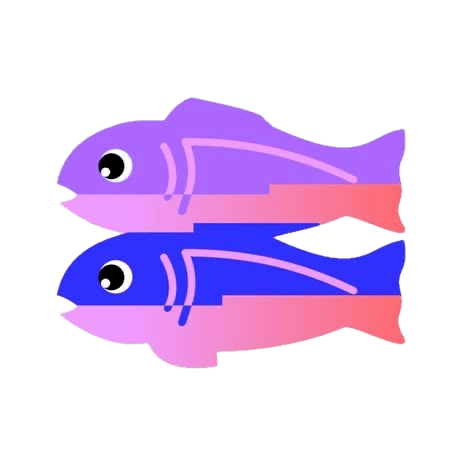

# 🌸 Glitch Archive

*A personal archive of my projects from Glitch.com*

## ✨ About

This is a collection of all my old projects from **Glitch**, a platform that played a huge role in my early web development journey. Glitch encouraged me to experiment, break things, remix weird little apps, and learn by doing — all in a colorful, welcoming corner of the internet.

Sadly, Glitch has now shut down.
I wanted to preserve these projects as a small tribute, a time capsule of my learning, curiosity, and creative exploration.

Some of these are messy. Some are broken. Some make no sense anymore. But each one meant something to me at the time: a step forward, a tiny victory, or just a playful afternoon tinkering with code.

## 📁 What's Inside

You'll find folders containing individual projects exactly as I downloaded them from Glitch. This includes:

* Early HTML/CSS experiments
* JavaScript doodles
* API demos
* Tiny games
* Half-finished ideas..

## 🌐 Why Keep This?

Because it's important to remember where we started.
Because not everything on the internet should be optimized, monetized, or serious.
Because creativity thrives in small, strange, imperfect places.

Glitch was one of those places for me. This archive is my way of keeping a little piece of it alive.

## 🦄 Thank You, Glitch

Thanks to the Glitch team, the community, and everyone who ever shared a remix link. You helped make the internet feel like a playground again.
### **Long live Glitch! 💖**
